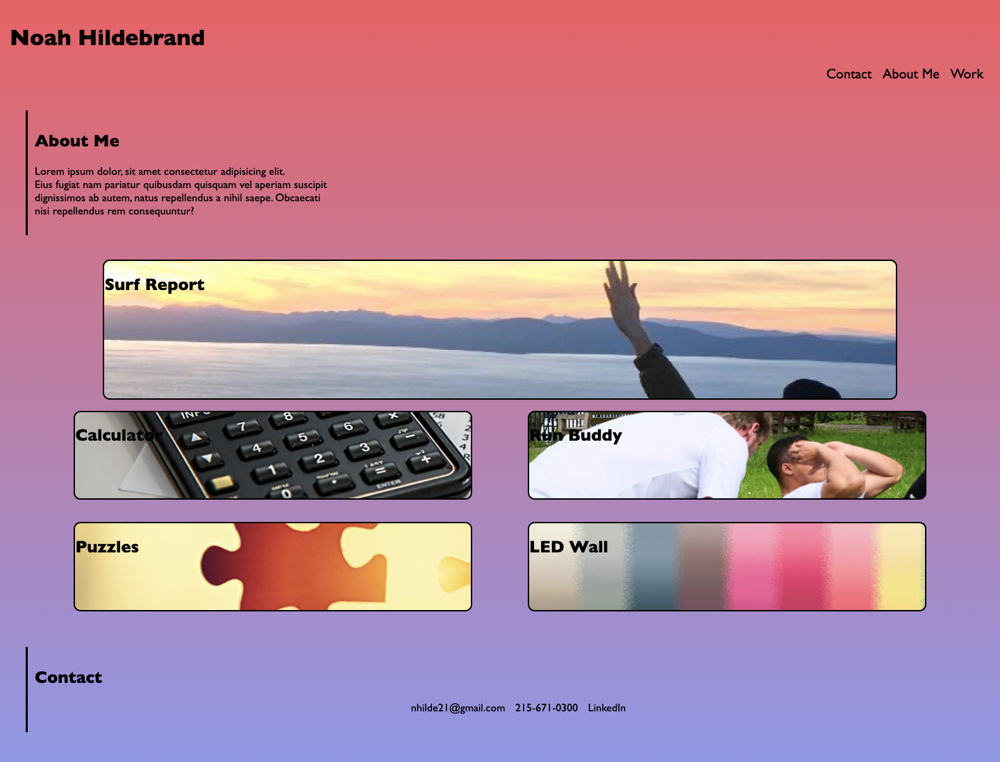

# Portfolio

## Description

My first portfolio gives me a place to showcase my work and show possible future employers my skills.
 It was a great learning experiance to learn flexbox and build an application from scratch. It consilidates 
 my work into one convenient spot to display, and can be updated and enhanced along the way.

## Installation

The application can be accessed by either the repository or through the link provided below.

[Portfolio](https://nhilde.github.io/Portfolio/)

## Usage

The main use of this application is to display my work.

  

## License

Licensed under the [MIT License](LICENSE)